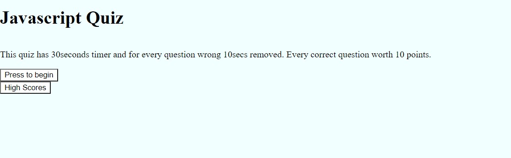
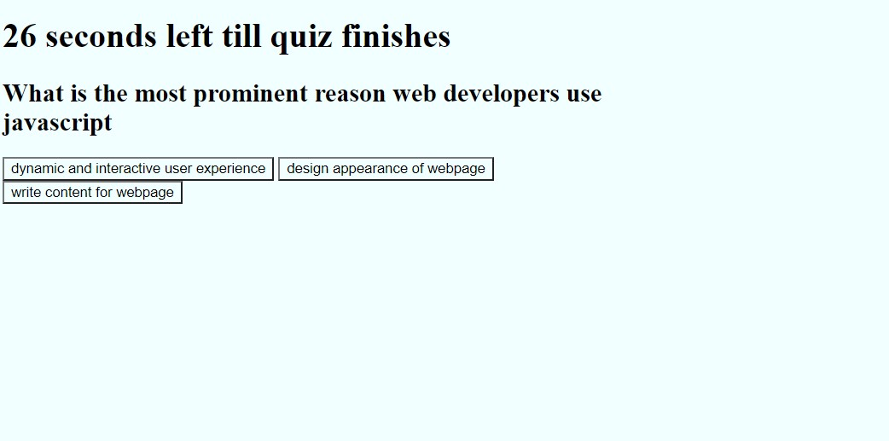

# Javascript-Quiz
<a href="https://manny1998.github.io/Javascript-Quiz/">Javascript Quiz</a>

Although this javascript quiz is very simple, making a javascript quiz requires a strong knowledge of javascript. However, this webpage doesnt use the most appropriate functions which therefore results in the coding not being the most effecient. 
Ideally, the questions would be placed in array which when then be displayd using a function. 

*Missing highscores table (which stores initials and points), --time 10 second penalty.

 

 